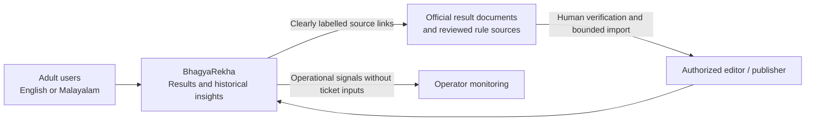
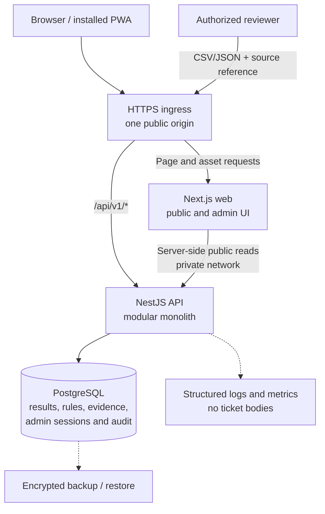

# Architecture — BhagyaRekha

**Version:** 1.1 · **Date:** 24 September 2026 · **Status:** baseline; Stage 1 implemented (Vitest replaces Jest, see §4)

## 1. Architectural decision

Use a **modular monolith**: one Next.js web application, one NestJS API, and one PostgreSQL database per environment. The API contains independently testable domain modules, not independently deployed microservices. Start with a human-reviewed import workflow rather than automated scraping.

The user-facing differentiator is understandable, traceable results. The engineering differentiator is safe handling of incomplete and corrected results. A predictive model is not part of this architecture.

This document defines proposed choices. External implementation facts are referenced as `[Sxx]` in [references.md](references.md). No official lottery rule configuration or live data feed has been verified by this design work.

## 2. System context



Do not make the browser call a government endpoint for business logic. A source document is evidence; it is not automatically a stable API, an uptime dependency, or proof that all prize categories were captured.

## 3. Container architecture



**Release-1 runtime count:** two application processes plus PostgreSQL and ingress. The ingress may be managed hosting infrastructure; it does not require a custom application service. No standalone worker is required for bounded manual imports.

### Request ownership

| Concern | Owner | Boundary |
|---|---|---|
| SEO/public HTML, responsive layout, translations | Next.js | Reads API; never imports ORM entities or accesses DB |
| Form and response runtime validation | Shared contracts + API validation adapter | Client validation is a convenience, not authorization |
| Ticket evaluation | Pure domain engine called by API | Never trust a client-calculated prize |
| Rule/source review and publication | NestJS application services | Server-authenticated, transactional, audited |
| Data integrity and concurrency | PostgreSQL constraints + transactions | Application checks supplement, not replace, constraints |
| Source acquisition in MVP | Human operator | No arbitrary server URL fetch or scheduled scraper |
| Deployment mode | Server environment and DB marker | Browser cannot switch live/demo datasets |

Server components suit read-oriented UI; small client components own the ticket form, language/text preferences, and charts. Keep the client boundary narrow rather than marking every page as client-side. `[S02, S14]`

## 4. Chosen stack and compatibility policy

| Layer | Choice | Rationale |
|---|---|---|
| Workspace | pnpm, TypeScript | Shared contracts and simple local commands |
| Web | Next.js App Router + React | Mobile web, indexable result pages, installable PWA |
| Styling | Tailwind + accessible primitives as needed | Consistent tokens and controls without a large design-system project |
| API | NestJS with Express adapter | Clear module boundaries and familiar integration style |
| Contracts | Zod schemas + inferred types | One transport schema used by API, web forms, and OpenAPI generation |
| Domain | Framework-free TypeScript package | Fast unit tests; deterministic evaluation and metrics |
| Persistence | PostgreSQL + TypeORM | Relational constraints, transactions, explicit migrations |
| Unit/integration tests | Vitest, Supertest, real PostgreSQL test database | NestJS 12 ships ESM and recommends Vitest for ESM projects (Jest needs Node ≥ 24.9 for it); exercises matching and real persistence semantics |
| Browser tests | Playwright + accessibility tooling | End-to-end and responsive checks |

Do not pin untested framework versions in these documents. During scaffolding, choose mutually compatible maintained stable releases, record the runtime/package-manager versions, commit the lockfile, and run the full build. The documentation was consulted on the date above; it is not a compatibility test.

Use a small custom Nest pipe around Zod `safeParse` if needed, avoiding dependence on an unverified adapter. Validate body, params, and query schemas explicitly. Zod-backed runtime validation is a supported Nest integration pattern, but APIs vary with framework version. `[S03]`

## 5. Repository and module boundaries

```text
bhagyarekha/
  CLAUDE.md
  apps/
    web/
      src/app/[locale]/
      src/components/
      src/features/{results,ticket-check,history,statistics,admin}/
      src/i18n/
      public/
    api/
      src/modules/
        catalog/             # lotteries, draw identity and scheduling
        rule-versions/       # reviewed immutable rule definitions
        results/             # revisions, completeness and public reads
        ticket-check/        # validation, snapshot and engine orchestration
        imports/             # bounded preview and draft construction
        publishing/          # review/publish/suspend transactions
        statistics/          # snapshot selection and descriptive aggregates
        auth/                # admin sessions, CSRF and authorization
        audit/               # append-only operational evidence
        health/
      src/database/migrations/
      src/cli/
  packages/
    contracts/               # runtime schemas and transport types
    domain/                  # pure matching and metric functions
  tests/e2e/
  infra/                     # local compose and deployment examples
  docs/
```

Dependencies flow inward: controllers → use-case services → domain and repositories. The domain imports neither NestJS nor TypeORM. Shared transport contracts do not import database entities. The frontend may import contracts but never the domain engine for authoritative checking.

Avoid generic repository frameworks, event buses, and dependency injection within the pure domain package. Use a transaction context explicitly at persistence boundaries.

## 6. Data and publication architecture

Three independently modelled facts matter:

1. **Draw schedule:** scheduled, postponed, held, or cancelled.
2. **Result publication:** no public revision, partial public revision, complete public revision, or suspended visibility.
3. **Checking capability:** reviewed supported rules or unsupported/unreviewed rules.

Do not compress these into `processed = true` or a single “success” flag.

A draft can be edited with optimistic concurrency. A reviewed draft is frozen by its content hash. Publishing atomically activates that revision, moves the previous revision out of current visibility, advances the affected lottery's dataset version, and appends an audit record. Numbers/rules already published are never edited in place.

A correction is another reviewed revision. Emergency suspension hides the current payload from current-result and check endpoints while preserving history for authorized audit. A source contradiction is not resolved automatically by “last write wins.”

PostgreSQL row locks serialize concurrent publication of a draw. All work inside a TypeORM transaction must use its provided transaction manager. `[S04, S06]`

## 7. Demo and production isolation

Use separate deployment databases for demo and live. A singleton `deployment_metadata` row identifies the database mode. Startup fails if the configured `DATA_MODE` and database mode disagree.

The demo seed CLI refuses a live-marked database. Both modes have the same schema and API contract, but every public response exposes `dataMode`. Demo pages display a persistent sample banner and are excluded from indexing. Live mode with no data returns honest pending/empty states; it does not load fixtures.

A synthetic rule can be approved for demo only. Its approval cannot be promoted into live by copying rows. Live activation needs independent reviewed evidence.

## 8. Consistency and caching

Correctness first: public dynamic results, history, and statistics start with `Cache-Control: no-store`. Disable intermediary and framework caching explicitly for these reads. Admin, auth, imports, and ticket-check responses are always private/no-store.

Next.js may cache static assets. The PWA initially caches the application shell and help content only. Optional offline result viewing stores a labelled last-seen snapshot in browser storage, never an unlabelled response fallback. Ticket checking is network-only and never replays queued requests in the background.

Every ticket-check response identifies its revision and checked time. It is correct for the committed snapshot taken when checking starts; a correction committed a moment later can change the answer. Do not claim an impossible guarantee of correctness against all future revisions. Re-check on demand.

When traffic justifies caching, use per-lottery `dataset_version` in statistics keys and revision identifiers in result keys. Cache invalidation is a release gate, not a TODO hidden behind TTL. If asynchronous delivery becomes necessary, add a transactional outbox; never rely on a best-effort in-memory event after commit.

## 9. Deployment and operations

Local: web, API, and Docker Compose PostgreSQL. Same-origin routing should be exercised locally, not only in production.

Initial production: one web instance, one API instance, managed PostgreSQL, HTTPS ingress, secrets manager, centralized logs, and monitored backups. Choose a supported region/provider during deployment planning; no vendor subscription or capacity is assumed here.

Run migrations as a release job, not concurrently from every application replica. Disable `synchronize` in all environments to make schema drift visible. Use expand/contract changes when an old application instance can overlap a new one. `[S05]`

Separate database roles: migration owner and restricted runtime role. Keep PostgreSQL private. Backups cover published revisions, rule evidence, sessions as required, and audit history. Test restores before launch; a successful backup job alone is not proof of recoverability.

Scaling order: measure → index/tune → provision appropriate database/app capacity → add validated public caching → add API replicas and shared rate limits → only then consider background workers. Statistics over a bounded first-prize archive do not justify a separate analytics platform by default.

## 10. Security and privacy boundary

Public endpoints are anonymous and read-only except the non-persistent ticket-check POST. Admin endpoints use secure cookie sessions, server-side permissions, CSRF controls, throttling, and audit. Browser storage is not an admin-token store. `[S08, S09]`

No public ticket photographs, saved ticket numbers, or consumer accounts in release 1. Do not collect entered numbers through logs, tracing, error bodies, replay tools, URLs, or analytics. Network/security metadata may still be processed transiently; describe it accurately rather than claiming zero data collection.

Admin source references are rendered safely as external links; the server does not fetch them. Future fetchers require SSRF review. Uploads are UTF-8 CSV/JSON only, bounded and validated, never executable or publicly served. `[S12]`

## 11. Architecture decision records

| ID | Decision | Alternative rejected or deferred | Revisit trigger |
|---|---|---|---|
| ADR-01 | Modular API monolith | Microservices | Independent teams or proven isolation needs |
| ADR-02 | PWA first | Separate native apps | Validated native requirements and store eligibility |
| ADR-03 | Same public origin | Cross-origin browser auth | Hosting constraints justify added complexity |
| ADR-04 | Reviewed manual imports | Unverified scraping/feed | Stable permitted source with reconciliation and monitoring |
| ADR-05 | Immutable publication snapshots | Updating winning rows in place | Do not relax; corrections remain versioned |
| ADR-06 | Versioned declarative matcher | Hardcoded per-screen matching or arbitrary scripts | New verified rule kinds via schema/engine version |
| ADR-07 | No dynamic response cache initially | Redis/CDN response caching | Measured load plus tested invalidation |
| ADR-08 | Cookie sessions for small admin team | Browser bearer tokens | Future authenticated third-party API is separately designed |
| ADR-09 | Descriptive statistics | Prediction/ML service | Credible preregistered research, not marketing demand |
| ADR-10 | Separate live/demo databases | Client mode switch or mixed fixtures | Do not relax for convenience |
| ADR-11 | One-draw, bounded synchronous imports | Background queue | Time/size limits prevent legitimate operational use |
| ADR-12 | Shared runtime schemas | Parallel web/API DTO definitions | Revisit only with generated compatibility checks |

## 12. Deferred extensions

A publisher widget can reuse a scoped public read API later, but needs rate limits, licensing/source review, and embeddability rules. Payments, subscriptions, advertisements, push, and native packaging require separate design/provider review. Do not build empty tables or services for them now.

## 13. Open decisions and release blockers

Real lottery catalogs, allowed series, prize matching and non-stacking rules, source usage terms, translation review, infrastructure ownership, backup settings, and launch compliance need verification. The source site's reproduction policy and disclaimer do not certify this product or authorize every downstream source. `[S10, S11]`

The architecture remains useful without those inputs: build the full flow with synthetic examples and a functioning reviewed import path, while keeping live publication and automated ticket checking closed until their specific prerequisites are met.
