# High-level design — BhagyaRekha

**Version:** 1.0 · **Date:** 24 September 2026 · **Status:** proposed product/system design

Read with [architecture.md](architecture.md), [low-level-design.md](low-level-design.md), and [references.md](references.md). Numerical performance/capacity values below are proposed targets, not measurements or hosting promises.

## 1. Product outcome and audience

BhagyaRekha / ഭാഗ്യരേഖ helps adults approximately 25–70 view lottery results, compare a ticket with a specific published draw, verify the source, and explore historical statistics. It does not validate ownership/authenticity, submit claims, sell tickets, or establish a predictive edge.

The primary user should not need to understand a chart, create an account, or dismiss an advertisement to check a result. Advanced information is one level deeper rather than crowding the home page.

| User | Need | Design response |
|---|---|---|
| Occasional mobile visitor | Quickly find the correct result | Latest published draw plus clearly separate upcoming/pending draw |
| Older or low-vision visitor | Read numbers and operate controls confidently | Larger text, high contrast, large labelled targets, persistent text-size controls |
| Malayalam-first visitor | Understand instructions and errors | EN/ML messages throughout, not just translated navigation |
| Returning researcher | Compare a bounded period | Filters, sample-size labels, accessible tables, no predictive claims |
| Editor/publisher | Import accurate results and fix mistakes | Preview, source evidence, review, atomic publication, correction history |

## 2. Scope boundary

**Release 1:** results home; draw details and prizes; ticket comparison; history; descriptive statistics; help; English/Malayalam; text sizing; installable web shell; authenticated admin import/review/publish; audit and correction workflow.

**Deferred:** push notifications, payments, subscriptions, advertisements, saved consumer accounts/tickets, publisher billing, native app stores, camera/OCR, automated source scraping, live-video integration, inferential statistics, and prediction models.

Every page must behave meaningfully with no verified data. A working demonstration is allowed only with permanent sample labelling and isolated fixtures.

## 3. Information architecture

| Route | Primary task | Important state |
|---|---|---|
| `/{locale}` | Latest result and ticket-check entry | Separate latest published from pending upcoming draw |
| `/{locale}/results/{drawId}` | Read all prize categories | Revision, category completeness, source, correction/suspension notice |
| `/{locale}/check` | Select draw, enter series/number | Context selection before typing; no ticket data in URL |
| `/{locale}/history` | Filter past draws | Missing archive coverage is not “no draws existed” |
| `/{locale}/statistics` | Explore historical observations | Single lottery and explicit category/period |
| `/{locale}/help` | Learn and verify | Independent-app status and official-source guidance |
| `/{locale}/admin/login` | Authorized operator login | No public registration |
| `/{locale}/admin/imports` | Preview and validate upload | Not automatically published |
| `/{locale}/admin/revisions/{revisionId}` | Review/publish/correct | Conflict-safe version checks |

Locale is `en` or `ml`. Public history date/lottery filters may be URL parameters. Exact number searches and ticket inputs remain in component state and POST bodies; they are not shareable URL parameters or persisted browser history.

### Desktop composition

Header: brand, Results / Check / History / Statistics, language, text size. Main content: large latest-result card and ticket-check panel. Then recent draws, explanatory help, and a quiet independent-service footer. Avoid showing every frequency chart on the home screen.

### Mobile composition

Brand and preferences → latest-result card → prominent check action → recent draws → bottom navigation. Bottom navigation has icons **and text**, safe-area padding, and must not obscure focused elements or the final form button. Expanded result lists become cards rather than miniature desktop tables.

Use the [reference image](reference-ui.png) as visual direction, not a literal screenshot to embed as the interface. Its ticket values and dates are sample content.

## 4. Core journeys

### J1 — View the latest result

The visitor selects a language, sees the latest **published** draw with explicit date/code, opens all prizes, and can follow the source link. If today's draw is pending, show it separately; do not place yesterday's number under today's heading. If no official schedule has been configured, do not invent a countdown or draw time.

### J2 — Check a ticket

Select lottery and draw → enter required series and number → submit → validate on server → evaluate one current revision → show the matching scope and verification context.

The interface distinguishes invalid input, unknown draw, unpublished result, partial result, unsupported rules, suspended result, and a complete supported no-match. A network error never turns into a losing verdict. A correction after the user opened the page triggers an explicit refresh/recheck state, not silent use of the old data.

### J3 — Browse history

Filter lottery and inclusive IST date range. Results are sorted by display date, then stable draw identity. Pagination is explicit. Search full numbers or suffixes with the selected search type. Return source and revision context on each opened draw.

### J4 — Explore statistics

Choose one lottery, first-prize entries, and a bounded date range. Show dataset coverage and number of observations before charts. The visitor can inspect frequencies, repeated suffixes, parity, digit sums, and in-number repetition. Explain denominators and excluded records. An empty sample says “No eligible verified observations in this range,” not “all digits have 0% chance.”

### J5 — Import and publish

The editor selects a draw and rule version, supplies an explicit category manifest and source reference, uploads a bounded CSV/JSON file, reviews row-level errors, creates a draft, and submits it for review. A publisher inspects the source, marks completeness with evidence, and publishes the frozen reviewed content. Imports never bypass the publish gate.

### J6 — Correct or suspend

For a source correction, clone the current revision into a new draft, change the affected data, record the reason and evidence, review, and publish. For an unresolved critical discrepancy, suspend current visibility immediately with an audit reason. Preserve every prior payload; do not delete “bad” rows to hide the incident.

## 5. Domain invariants

| ID | Invariant |
|---|---|
| INV-01 | Synthetic and live data never share an active deployment database. |
| INV-02 | Numbers are strings; series is separate; leading zeros survive every layer. |
| INV-03 | Lottery + draw code is the business identity; dates are not unique identifiers. |
| INV-04 | Published payloads and approved rule content are immutable. |
| INV-05 | A response uses one committed revision snapshot. |
| INV-06 | “Complete” requires every configured category plus human/source verification, not just nonzero row count. |
| INV-07 | Unsupported, missing, or revoked rules never produce a definitive automatic verdict. |
| INV-08 | A complete supported no-match requires evaluation of every relevant category. |
| INV-09 | Partial number matches are not final prize entitlements when dependencies are unresolved. |
| INV-10 | Source references and review provenance accompany public results. |
| INV-11 | Entered ticket numbers are not retained, logged, traced, or put in URLs. |
| INV-12 | Historical rates are not future winning probabilities. |

The LLD specifies their enforcement layers and tests. A feature is not complete merely because its happy-path screenshot looks correct.

## 6. Publication state model

```mermaid
stateDiagram-v2
    [*] --> DRAFT
    DRAFT --> READY: Review frozen content hash
    READY --> DRAFT: Edit or reject; invalidate review
    READY --> PUBLISHED: Atomic publish
    PUBLISHED --> SUPERSEDED: Publish a new revision
    SUPERSEDED --> [*]
```

`PARTIAL` versus `COMPLETE` is a separate attribute of the revision; it is not a workflow status. Draw scheduling and emergency visibility suspension are also separate dimensions. A `PUBLISHED` revision may intentionally be partial. `CORRECTION` is a publication kind requiring a reason, not a substitute for workflow/completeness.

Draft creation captures `based_on_revision_id`. Publication fails with a conflict if someone else changed the current revision since the draft was based on it. Editing reviewed content invalidates its review.

## 7. Main system flows

### Read/check flow

Browser → same-origin ingress → API validation → current draw/revision read → pure engine → structured response → accessible display. API reads use a consistent snapshot; browser offline storage is not authoritative. No background ticket submission or analytics body recording is allowed.

### Import flow

Authorized upload → byte/format limits → parse as strings → schema validation → row errors/duplicates → private preview → draft → source/completeness review → transaction → public current pointer.

For release 1, accept one draw per import, at most 2 MiB and 20,000 entries, with a 10-second overall processing deadline. These are tunable product limits, not official draw-size facts. Reject larger input clearly; do not truncate. If real workloads exceed them, revisit ADR-11 rather than adding an untested queue incidentally.

### Correction flow

Suspend when necessary → prepare correction against current revision → review → lock and publish → increment dataset version → current reads show new revision. Initially dynamic public responses are no-store, so no distributed invalidation service is required. An already-open page remains a labelled snapshot until refreshed; it is not a live subscription.

## 8. API capability map

| Capability | Public/admin | Responsibility |
|---|---|---|
| Lottery catalog and draw lists | Public | Stable identities, dates, states |
| Current draw result and prize pages | Public | Current revision only, safe provenance |
| Ticket check | Public POST | Ephemeral input; rule/completeness-aware evaluation |
| Historical number search | Public POST | Non-persistent bounded search |
| Descriptive statistics | Public | Explicit data-selection metadata |
| Session/login/logout | Admin | Secure session lifecycle and CSRF |
| Rule configuration and approval | Admin | Versioned source-backed behavior |
| Draw creation/scheduling | Admin | Correct stable identity and dates |
| Import preview and draft creation | Admin | Validation without automatic publication |
| Review/publish/suspend | Admin publisher | Authenticated atomic visibility changes |
| Health and readiness | Operator | Process health and dependency/config readiness |

See the LLD for exact paths, status codes, payloads, roles, and concurrency controls.

## 9. Accessibility and trust design

Target WCAG 2.2 AA, including contrast, text resizing, keyboard interaction, reflow, visible focus, labels, and status announcements. Normal text contrast is at least 4.5:1; large text has its applicable 3:1 threshold; text must remain usable at 200% resizing. `[S07]`

Choose 48 × 48 CSS-pixel touch targets as a **product target for this audience**, not a claim that WCAG AA specifically requires 48px. WCAG 2.2's minimum-target criterion uses a different threshold and exceptions. `[S15]`

Use around 18px body text with Standard/Large/Extra-large preferences and scalable spacing. Validate the actual combination of foreground/background colors, not only the token list. Use visible inline form messages and `aria-live="polite"` for new outcomes. Do not announce large tables automatically or repeatedly interrupt screen readers on refresh.

“Source reviewed” means reviewed by this application's operator; it must not resemble a government certification. Source failures, missing translations, partial data, and offline data must be explicit. Always present the full draw identity alongside the result number.

## 10. Quality targets and capacity assumptions

| Area | Initial acceptance target | How measured |
|---|---|---|
| Public page usability | Main content readable before chart code loads | Mobile browser profiling |
| Core Web Vitals | Aim for LCP ≤ 2.5s, INP ≤ 200ms, CLS ≤ 0.1 | Defined mobile lab profile initially; real-user measurement when justified |
| Read/check API latency | p95 ≤ 500ms at agreed baseline load | API load test, excluding public internet transit |
| Statistics API | p95 ≤ 1s for configured 366-day sample | Defined test archive and test machine |
| Load baseline | 50 read requests/s, 5 check requests/s for 10 minutes | Mixed endpoint test; no throughput claim until run |
| Import limits | 2 MiB, 20,000 entries, one draw, no truncation | Boundary and timeout tests |
| Availability objective | 99.5% monthly application availability | Proposed operational objective, not contractual SLA |
| Restore objective | RPO ≤ 24h and RTO ≤ 4h initially | Backup configuration plus actual restore drill |
| Accessibility | All core journeys pass automated and manual review | Keyboard, screen reader, text resize, zoom, touch checks |
| Correctness | Zero known false definitive verdict cases in specified tests | Fixtures, edge cases, race tests and source review |

The Web Vitals values are chosen product targets here, not evidence that the app meets them. Raw archive size depends heavily on all prize categories; estimate from actual sources before allocating storage. Do not estimate production volume from the number of first-prize observations alone.

## 11. Operational readiness

Provide liveness independently of external result websites. Readiness checks database connectivity, migration compatibility, and mode agreement. A temporarily inaccessible external source must not crash the application or overwrite existing verified results.

Metrics should cover API latency/errors, auth failures, import validation failures, published revision counts, source-review delay, suspensions, and correction frequency. Do not use ticket numbers, arbitrary URLs, or unbounded draw IDs as metric labels.

Set alerts only after defining expected timing per supported draw. Alert on sustained readiness failures or a configured overdue result, not an arbitrary universal “today” deadline. Keep logging in one structured pipeline; avoid duplicate collection.

Designate an operator for draw-day publication, a backup reviewer, and an error-reporting contact before launch. This is a human operation in the first release; do not market it as automated instant results.

## 12. Failure behavior

| Failure | Required behavior |
|---|---|
| Source unavailable | Keep last reviewed snapshot with date; new draw remains pending |
| API/DB unavailable | Friendly unavailable state; no synthetic fallback and no no-match |
| Partial import | Preview errors; no partial silent live write |
| Ambiguous source conflict | Require human resolution; do not choose newest automatically |
| Unsupported rule | Results can remain viewable; checking returns unsupported |
| Concurrent publication | Conflict response and re-review against current revision |
| Correction during check | Return one consistent snapshot; report its revision/time |
| Offline browser | Clearly labelled cached view; no authoritative check |
| Translation missing | Controlled readable fallback; flag for release review |
| Large text or small screen | Reflow; retain all controls and information |

## 13. Delivery stages

| Stage | Working vertical slice | Exit condition |
|---|---|---|
| 1 — Foundation + viewing | Workspace, DB migrations, mode isolation, synthetic catalog/result, responsive home/details | Fresh setup works; demo cannot look live; result query tests |
| 2 — Ticket checking | Rule compiler/evaluator, supported and unsupported states, form/API | INV-02/05/07/08/09 tests including partial/precedence |
| 3 — Admin operations | Admin/session/CSRF, draw/rule entry, imports, review/publish/correct/suspend | Real-DB transaction, idempotency, privilege and race tests |
| 4 — History + statistics | Filtering, private number search, defined descriptive metrics | Known-fixture counts, coverage labels, empty states |
| 5 — Hardening | PWA shell, accessibility, security, restore, CI, deployment runbook | End-to-end checks and documented launch gates |

Do not start all stages simultaneously as disconnected stubs. Each stage must preserve the earlier invariants. Do not expose a live deployment until the admin publication workflow and operational gates are complete, even if the demo UI is polished.

## 14. Acceptance criteria

| ID | Acceptance criterion | Evidence |
|---|---|---|
| AC-01 | Visitor can read a dated result and open its source without registration | E2E + manual source inspection |
| AC-02 | The latest published draw is never relabelled as a newer pending draw | Date/fixture integration test |
| AC-03 | The checker uses correct lottery, draw, series, number, revision, and rules | Unit + API + E2E |
| AC-04 | Partial, suspended, unpublished, and unsupported data cannot yield definitive no-match | Negative and race tests |
| AC-05 | Leading zeros persist in storage, API, rendering, search, and evaluation | End-to-end string test |
| AC-06 | Only authorized reviewed imports become current; duplicates do not duplicate winning rows | DB + auth tests |
| AC-07 | Corrections preserve previous payloads and update current views/statistics | Publication integration test |
| AC-08 | Users can enlarge text, change language, and complete tasks on mobile/keyboard | Accessibility review |
| AC-09 | Demo/live separation survives configuration mistakes and seed attempts | Startup and CLI tests |
| AC-10 | Ticket entries never appear in persistent logs, URLs, analytics, or browser storage | Log/browser inspection |
| AC-11 | Statistics declare scope, units, exclusions, and missing coverage | Known-fixture test + UI inspection |
| AC-12 | Fresh checkout setup and CI run without hidden developer credentials | Clean-machine run |

## 15. Production gates and unresolved inputs

Launch requires actual source-backed lottery rules, imported/reviewed data, source-permission review, Malayalam review, core-journey accessibility checks, secure admin deployment, tested backups, named operational owners, and monitoring. Legal/payment/ad-store eligibility is not established by these documents. Kerala's source disclaimer recommends checking ambiguities with the Directorate or other appropriate sources. `[S10, S11]`

The design can be fully implemented and demonstrated before these gates are met, but must then remain clearly a demo or a restricted staging service.
