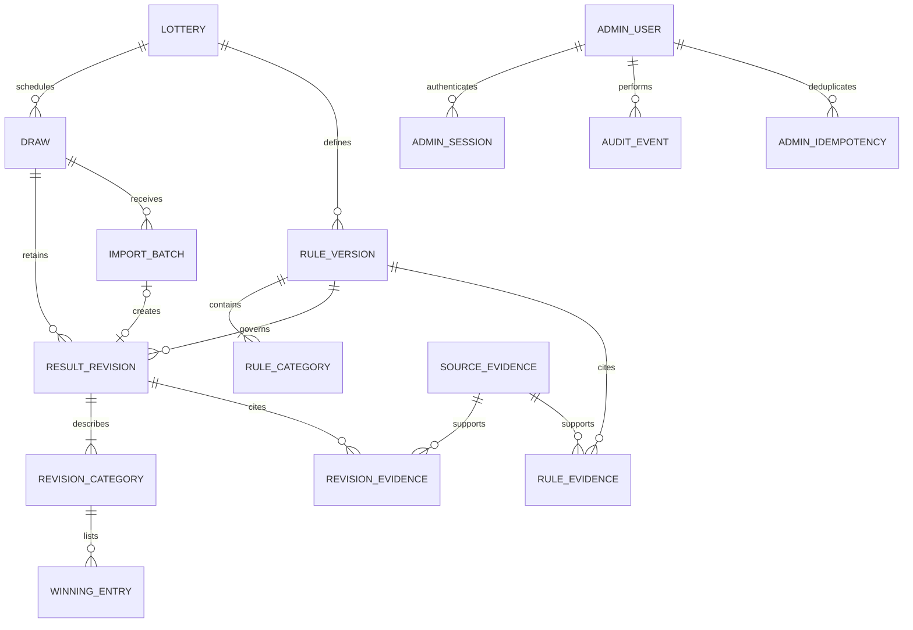
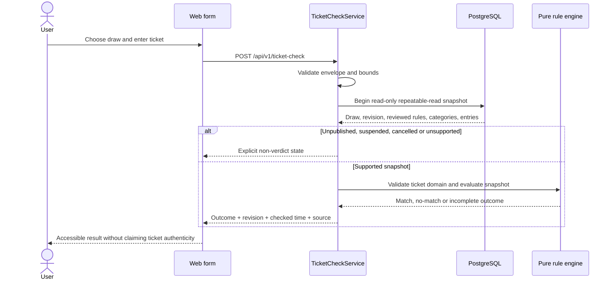

# Low-level design — BhagyaRekha

**Version:** 1.0 · **Date:** 24 September 2026 · **Status:** implementation specification, not application source

Read the [architecture](architecture.md), [HLD](high-level-design.md), [source register](references.md), and [synthetic examples](examples/README.md). Code fragments define contracts/algorithms; they have not been executed as an application. All example tickets, prizes, and rules are synthetic.

## 1. Conventions and shared contracts

Public identifiers are UUID strings. Internal sequence IDs and monetary minor units are serialized as decimal strings when a JavaScript safe integer cannot be assumed. PostgreSQL timestamps are `timestamptz`; local draw dates are `date`. API timestamps use ISO 8601 UTC; the UI formats instants in `Asia/Kolkata`. Date-only values remain validated `YYYY-MM-DD` strings rather than UTC-parsed JavaScript dates.

Normalize ticket input with outer whitespace trimming and uppercase series. Accept ASCII digits only in v1. Reject internal spaces, separators, non-digit characters, wrong lengths, or invalid series with a readable error; do not strip arbitrary characters. Do not infer, pad, or truncate a number entered by a user. Imports likewise never guess zeros lost by a spreadsheet.

`packages/contracts` contains strict Zod request/response schemas and inferred transport types. A reusable Nest pipe validates body/query/params. The web consumes the same schemas for form feedback. Generate OpenAPI from these schemas using a tested compatible integration; add a drift check. Do not duplicate schemas in separate decorator DTOs.

The following are canonical state names:

```ts
type DataMode = 'demo' | 'live';
type DrawPhase = 'SCHEDULED' | 'POSTPONED' | 'HELD' | 'CANCELLED';
type Visibility = 'ACTIVE' | 'SUSPENDED';
type RevisionState = 'DRAFT' | 'READY' | 'PUBLISHED' | 'SUPERSEDED';
type Completeness = 'PARTIAL' | 'COMPLETE';
type CategoryState = 'MISSING' | 'PARTIAL' | 'COMPLETE';
type PublicationKind = 'INITIAL' | 'UPDATE' | 'CORRECTION';
type RuleState = 'DRAFT' | 'APPROVED' | 'REVOKED';
type CheckOutcome =
  | 'MATCH' | 'NO_MATCH' | 'PARTIAL_MATCH' | 'RESULT_INCOMPLETE'
  | 'RESULT_NOT_PUBLISHED' | 'RULES_UNSUPPORTED'
  | 'RESULT_SUSPENDED' | 'DRAW_CANCELLED';
```

Bad input, missing draw, stale expected revision, and infrastructure failure are HTTP errors, not entries in `CheckOutcome`. A machine-readable `code` accompanies every error. Localized messages are mapped by the web; internal stack traces and entered values are never returned.

## 2. NestJS module/service responsibilities

| Module | Principal services | Persistence responsibility |
|---|---|---|
| Catalog | `LotteryService`, `DrawService` | Identity, schedule, visibility metadata |
| RuleVersions | `RuleVersionService`, `RuleCompiler` adapter | Draft/approved/revoked rule versions and evidence |
| Results | `ResultReadService`, `RevisionDraftService` | Snapshot reads and optimistic draft edits |
| TicketCheck | `TicketCheckService` | Read consistent snapshot; call pure evaluator; no input storage |
| Imports | `ImportPreviewService`, `ImportDraftService` | Private bounded source payload and validation output |
| Publishing | `ReviewService`, `PublishService`, `SuspendService` | Locked state transitions, public pointer, dataset version |
| Statistics | `ObservationSelector`, `StatisticsService` | Consistent eligible observation selection |
| Auth | `AdminSessionService`, `PermissionGuard`, `CsrfGuard` | Admin users, sessions and revocation |
| Audit | `AuditService` | Append-only events, called inside mutation transaction |
| Health | `HealthService` | Liveness/readiness without public source dependencies |

`RuleCompiler` and metrics are deterministic functions in `packages/domain`; Nest adapters load their data and handle errors. Persistence methods accept a transaction manager explicitly where applicable. Do not inject one hundred constructor arguments into a worker factory; no such worker exists in this release.

## 3. Relational model

### 3.1 Entity relationship diagram



The ERD is conceptual. `draw.current_revision_id` is the authoritative current pointer, with the composite foreign key below enforcing that it belongs to that draw. Definitions include some nullable review fields during draft creation; a draft need not yet satisfy all published cardinalities.

### 3.2 Tables and important columns

All mutable aggregate rows include `created_at`, `updated_at`, and a numeric `edit_version`. User/account deletes are disabled when needed for audit referential integrity; deactivate instead.

| Table | Important columns / constraints |
|---|---|
| `deployment_metadata` | Singleton `id=1`; `data_mode` demo/live; initialized by an explicit environment-init step after migrations; startup requires mode match |
| `lottery` | UUID PK; unique `code`; unique slug; EN/ML names; active flag; `dataset_version bigint NOT NULL DEFAULT 0`; archive-coverage status |
| `rule_version` | UUID PK; lottery FK; `version int`; schema/engine versions; number length 1..12; allowed series/first-digit arrays; award policy; DRAFT/APPROVED/REVOKED; canonical hash; approval/revocation actors/times/reason; unique `(lottery_id, version)` and `(id, lottery_id)` |
| `rule_category` | Composite PK `(rule_version_id, code)`; localized labels; priority; metric role; match kind/series policy; optional suffix length; excluded-category codes; optional expected-entry count; unique priority within a version |
| `draw` | UUID PK; lottery FK; `draw_code`; scheduled/actual local dates and optional instants; phase; visibility; current revision nullable; `next_revision_no`; edit version; unique `(lottery_id, draw_code)` and `(id, lottery_id)` |
| `result_revision` | UUID PK; draw/lottery/rule-version IDs; revision number; immutable `draw_snapshot jsonb` containing reviewed code/dates/instants; based-on revision nullable; workflow state; publication kind; completeness; content hash; reviewed hash/actor/time; published actor/time; correction reason; unique `(draw_id, revision_no)`, `(id, draw_id)`, `(id, rule_version_id)` |
| `revision_category` | PK `(revision_id, category_code)`; rule-version FK context; MISSING/PARTIAL/COMPLETE; `amount_minor bigint` nullable; source-review actor/time/note; expected count comes from configured rule where known |
| `winning_entry` | Bigint PK; revision/category FK; `series varchar(8) NOT NULL DEFAULT ''`; `number varchar(12)`; original source row when available; unique `(revision_id, category_code, series, number)` |
| `source_evidence` | UUID PK; kind OFFICIAL_DOCUMENT/MANUAL_TRANSCRIPTION/SYNTHETIC_FIXTURE; safe URL nullable; title; source-document hash nullable; reviewed actor/time; review note; acquisition time nullable; immutable once referenced by approved/published content |
| `revision_evidence` | PK `(revision_id, evidence_id)`; both FKs; every published revision must have suitable reviewed evidence |
| `rule_evidence` | PK `(rule_version_id, evidence_id)`; rule approval requires suitable reviewed evidence |
| `import_batch` | UUID PK; draw/rule IDs; actor; manifest; raw UTF-8 upload as private `bytea` capped at 2 MiB; upload hash; canonical payload hash; validation status/errors; parsed preview; created revision nullable and unique |
| `admin_user` | UUID PK; normalized unique email; password hash; role EDITOR/PUBLISHER; disabled flag; auth-version counter |
| `admin_session` | UUID PK; user FK; unique SHA-256 hash of random opaque session token; random CSRF token; created/last-seen/idle-expiry/absolute-expiry; revoked time; captured auth-version |
| `audit_event` | Bigint PK; actor; action; entity type/id; time; before/after hashes; allowlisted metadata; request ID; append-only |
| `admin_idempotency` | Composite key `(actor_id, operation, idempotency_key)`; request hash; resulting status/response; created/expiry; unique reservation inside mutation transaction |

`raw_upload` is private admin evidence, not a public file. It is never interpreted as HTML or served inline. Uploaded CSV hash is **not** the hash of the official source document. Store those separately and leave a document hash null if it was not actually computed.

The normalized `rule_version` + `rule_category` rows are the rule source of truth. Importable rule JSON is their wire representation, not a second independently editable configuration.

### 3.3 Required database constraints

- Revision/draw and revision/rule-version pairs must belong to the same lottery through composite FKs.
- Add `FOREIGN KEY (current_revision_id, id) REFERENCES result_revision(id, draw_id)` on `draw` after both tables exist. Null current pointers are permitted.
- Add `FOREIGN KEY (revision_id, rule_version_id) REFERENCES result_revision(id, rule_version_id)` on `revision_category`, and `(rule_version_id, category_code)` → `rule_category`.
- Entries reference `(revision_id, category_code)`; use `ON DELETE RESTRICT` for published evidence/history.
- Enforce ASCII digits on entry numbers and nonnegative prize amounts. Enforce supported broad series syntax at the DB; rule-specific membership/length checks run in the compiler/import validator.
- Require at least one known local date for a draw. If an instant and its local date are both present, they must agree in IST. Never synthesize midnight to fill an unknown draw time.
- `CORRECTION` publication requires a nonempty reason. `INITIAL` has a null based-on revision; later revisions reference a predecessor from the same draw.
- Database guards reject changes to entry/category payloads unless the parent revision is DRAFT. Rule/category payload edits require DRAFT rule state. Review and publication metadata may transition through approved service paths; protected content may not.
- Approved rule content cannot be changed. Revocation is a state change with reason; replacement content requires a new version.

Publication invariants involving row counts, category manifests, reviewed evidence, and compiled rules are checked by the locked service transaction. Do not pretend a single-column CHECK can validate all related rows.

### 3.4 Indexes and migration strategy

Initial indexes:

```sql
CREATE INDEX draw_lottery_display_date_idx
ON draw (lottery_id, (COALESCE(actual_date, scheduled_date)) DESC, id DESC);

CREATE INDEX revision_draw_state_idx
ON result_revision (draw_id, workflow_state);

CREATE INDEX winning_entry_lookup_idx
ON winning_entry (revision_id, category_code, number, series);

CREATE INDEX audit_entity_time_idx
ON audit_event (entity_type, entity_id, created_at DESC);
```

Use the unique indexes described above for session lookups and identity. Add suffix expression indexes only after measuring a real query plan; bounded per-revision reads are the initial strategy. Never cast stored ticket strings to numbers for matching. Do not add `NULLS LAST` or functions to indexed sort columns without validating the resulting plan.

Migration order: metadata/admin foundations → lottery/rules/source evidence → draw → revision/category/entry → current-pointer FK and immutability guards → imports/audit/idempotency/sessions → indexes. Use a migration-only database role; runtime `synchronize` remains false. Unit tests must not accidentally run migrations or load production config. `[S05]`

## 4. Declarative rule engine

### 4.1 Version-1 supported language

The schema is closed and allowlisted: no executable code, SQL, user-defined regex, `eval`, or arbitrary expressions.

```ts
type MatchSpec =
  | { kind: 'FULL_NUMBER'; seriesPolicy: 'MATCH_ENTRY' | 'EXCEPT_ENTRY' | 'ANY_ALLOWED' }
  | { kind: 'SUFFIX'; seriesPolicy: 'ANY_ALLOWED'; suffixLength: number };

interface RuleCategorySpec {
  code: string;
  labels: { en: string; ml: string };
  metricRole: 'FIRST_PRIZE' | 'OTHER';
  priority: number; // Lower value has higher award priority.
  match: MatchSpec;
  excludedBy: string[];
  expectedEntryCount: number | null;
}

interface RuleSetV1 {
  schemaVersion: 1;
  engineVersion: 'v1';
  lotteryCode: string;
  ruleVersion: number;
  numberLength: number;
  allowedFirstDigits: string[];
  allowedSeries: string[];
  awardPolicy: 'SINGLE_BY_PRIORITY';
  categories: RuleCategorySpec[];
}
```

These capabilities are proposed engine capabilities, **not verified descriptions of any real Kerala scheme**. V1 intentionally does not implement award stacking. A real game that cannot be faithfully represented must remain unsupported until its engine/schema and tests are extended.

Compiler checks: unique category codes/priorities; known exclusion targets; no exclusion cycles; every exclusion points to a higher-priority category; nonempty valid domains; full-number and suffix lengths; valid expected counts; available engine version; reviewed approved rule state. Match-entry/exclude-entry policies require nonempty entry series; ANY_ALLOWED entries use the empty series sentinel.

`FULL_NUMBER / EXCEPT_ENTRY` means number equals the entry number and the ticket's allowed series differs from the entry's series. It does not mean “any invalid series is eligible.” Series membership validation runs first. `SUFFIX` compares exact fixed-length strings.

### 4.2 Evaluation algorithm

1. Validate request envelope, resolve lottery/draw, and reject a mismatched pair.
2. Open a short read-only repeatable-read transaction. Read draw, current revision, rule status/content, category manifests, and candidate entries from the same snapshot.
3. Return suspended/cancelled/unpublished states before attempting a verdict. Return RULES_UNSUPPORTED if the version is unreviewed, revoked, unknown, or not compilable.
4. If `expectedRevisionId` was supplied and differs from the current revision, return HTTP 409 `RESULT_CHANGED`; ask the user to refresh/recheck.
5. Validate ticket length, first digit, and allowed series against that revision's rule. Keep the number as a string.
6. Validate manifest consistency first: a revision labelled COMPLETE with incomplete/unreviewed categories is an integrity failure (503), not an ordinary partial response. Compute raw category matches against only that revision. Evaluate categories in configured priority order; apply exclusions based on the matched higher-priority category set. Do not sum amounts.
7. If any required category is incomplete, return PARTIAL_MATCH when a raw number/series match exists, otherwise RESULT_INCOMPLETE. A partial match is provisional; do not assert a final payable amount, even when the displayed number is confirmed in one category.
8. If all categories are complete and verified, return MATCH for the eligible highest-priority category or NO_MATCH if none qualify. If manifest/entry invariants disagree, return 503 `RESULT_UNAVAILABLE`, not NO_MATCH.
9. Return revision/rule IDs, checked time, category scope, source context, and data mode. Do not echo or persist the entered ticket.

The transaction is short and performs no network calls. Repeatable read supplies one stable committed snapshot, not a lock against all future corrections. `[S04, S13]`

### 4.3 Synthetic examples and expected outcomes

The bundled demo uses the invented series AA/AB/AC, full number `001234`, and suffix `1234`. It has first/consolation/last-four categories solely to exercise the implementation; the prize amounts and policies are invented.

| Ticket in synthetic complete draw | Expected |
|---|---|
| AA / 001234 | MATCH FIRST; do not also award suffix |
| AB / 001234 | MATCH CONSOLATION under EXCEPT_ENTRY |
| AB / 991234 | MATCH LAST4 |
| AB / 994321 | NO_MATCH |
| ZZ / 001234 | HTTP 400 INVALID_SERIES |
| AA / 1234 | HTTP 400 INVALID_NUMBER_LENGTH; do not pad |
| AB / 991234 with first category missing | PARTIAL_MATCH; final award unresolved |
| AB / 994321 with any category incomplete | RESULT_INCOMPLETE |
| Any valid input with revoked rules | RULES_UNSUPPORTED |

The amount is recorded in the result category, not guessed from its name. In partial responses, `awardConfirmed=false` and `amountMinor=null`; the category code can still identify where a provisional raw match occurred.

### 4.4 Ticket-check sequence



Close the transaction before sending the response on every branch. No cache or browser-side evaluator may bypass this sequence.

## 5. Imports, review and publication

### 5.1 Import envelope

CSV and JSON are supported; XLSX, PDF, ZIP and image parsing are deferred. One import concerns exactly one existing draw and selected rule version. Maximum raw input is 2 MiB, maximum 20,000 entries, UTF-8 only, and a 10-second deadline. Enforce size before parsing and counts during parsing; reject overflows without truncation.

A CSV upload includes a JSON manifest containing draw/rule identity, source metadata, publication kind, based-on revision, and **every category's completeness/amount**. CSV columns are `categoryCode,series,number`. Do not infer completeness from rows alone. Manifest business codes are resolved to the selected existing draw/rule IDs; envelope values cannot overwrite the catalog silently. Preserve 1-based source row positions in validation messages. JSON includes the same manifest plus category entries; see the bundled example.

Importer statuses: `VALIDATION_FAILED`, `PREVIEW_READY`, `DRAFT_CREATED`. Upload parsing is synchronous and bounded; there is no “processing started” response that falsely implies a background queue exists. Unexpected interruptions leave no published changes. Invalid previews may persist for admin correction with row errors, but cannot create a reviewed revision.

Validate: shape, IDs, known category codes, numeric strings, configured lengths/series, duplicates, expected counts when known, missing categories, malformed source links, and live/demo consistency. An apparent duplicate is an error to resolve, not a row silently dropped. A file with zero valid rows cannot be marked complete.

Metadata-only preview pagination prevents returning a 20,000-row payload to the browser. Display at most 100 rows/errors per page and allow the reviewer to inspect the rest. Never truncate errors and call the remainder valid.

### 5.2 Draft creation and review

`create-draft` accepts only PREVIEW_READY. Lock the lottery then draw, allocate the next revision number, capture the current revision as `based_on_revision_id`, capture an immutable reviewed-date/code snapshot in the revision, materialize every configured category (MISSING where appropriate), insert entries/evidence, and link the batch to the draft. A repeat call for the same batch returns its existing draft. Never allow the browser to choose an unrelated based-on pointer.

Edits require `If-Match` against the draft's edit version. After an edit, increment the version, recompute the canonical hash, and clear review metadata. READY content must return to DRAFT before edits. Canonical hashing sorts categories and entries and includes rule hash, identity, dates in the reviewed payload, amounts, completeness, and referenced evidence IDs; it excludes volatile database timestamps.

Review checks the actual source, each category manifest, configured entry counts, prize amounts, mode, and rule approval. Parsing is not review. Set `reviewed_hash = content_hash` and READY only after explicit confirmation.

Once a draw has a published revision, changing its published dates requires a new reviewed correction snapshot, not a direct schedule PATCH. Its lottery/code identity cannot be repurposed; a wrongly identified draw must be suspended and explicitly reconciled.

Default live policy requires a different reviewer from the latest editor. A single-operator launch may explicitly enable `ALLOW_SELF_REVIEW`, with a confirmation recorded for every publication. Demo can enable it. Never describe self-review as independent verification.

### 5.3 Atomic publish

All public-data/rule mutations acquire the affected lottery row first. Publishing then locks draw and revision in that order. Rule revocation also locks the lottery before changing status. This establishes consistent lock ordering and prevents a publish racing past a rule revocation.

Within one transaction:

```text
Validate actor, CSRF, request and idempotency key.
Reserve or replay the actor+operation+idempotency key.
Lock lottery FOR UPDATE, then draw FOR UPDATE, then revision FOR UPDATE.
Verify expected edit version and current pointer equals based_on_revision_id.
Require READY, reviewed_hash == content_hash, suitable evidence, and approved rules.
Re-check category/entry/amount/complete invariants and draw visibility policy.
Require explicit CORRECTION reason for a correction or completeness downgrade.
Mark old current revision SUPERSEDED if one exists.
Mark new revision PUBLISHED and record actor/time.
Set draw.current_revision_id to the new revision and apply its reviewed date summary to draw; reactivate only if explicitly requested.
Increment lottery.dataset_version and draw.edit_version.
Insert audit event, including old/new IDs, hashes, and self-review flag if applicable.
Store idempotent response and commit.
```

Nothing public changes if the audit insert, pointer update, or another step fails. Use only the transaction-scoped TypeORM manager. `SELECT FOR UPDATE` protects against concurrent conflicting writes. `[S04, S06]`

Same key + same request returns the committed prior result. Same key + different request returns 409 `IDEMPOTENCY_CONFLICT`. Keep keys for a configurable 72 hours. If a transport timeout follows commit, retrying cannot publish twice. If the old idempotent response references a now-superseded revision, include its original publication ID and have the UI refresh the current draw; do not pretend it is still current.

Concurrent publication based on an outdated current pointer returns 409 `REVISION_CONFLICT`. Rebase the draft, inspect differences, and review again. Never silently replace a newer revision.

### 5.4 Corrections, suspension and revocation

`CORRECTION` clones current content into a new draft, adds changed evidence and a reason, then follows the same pipeline. `UPDATE` extends a partial result without claiming prior data was wrong. Restoring an older payload also creates a new correction revision; never reassign current to an old row without review.

Suspension is an immediate publisher operation with reason, lottery/draw locks, edit-version check, dataset-version increment, and audit. Current public endpoints withhold the disputed payload and ticket checks return RESULT_SUSPENDED. Admin audit retains access. Reactivation requires explicit reviewed publication or a publisher-reviewed resolution action with a reason.

Revoking a rule disables automatic checking for current results that use it. Existing numbers can remain viewable unless the results themselves are disputed. Update the lottery dataset version; statistics exclude unsupported revoked rule domains until reviewed replacement. Published rule payloads remain immutable.

```mermaid
sequenceDiagram
    actor Publisher
    participant API as PublishService
    participant DB as PostgreSQL
    Publisher->>API: Publish READY revision with expected version and key
    API->>DB: Begin transaction; reserve idempotency key
    API->>DB: Lock lottery, draw and revision
    API->>API: Validate source, rules, hash, categories and predecessor
    alt Conflict or invalid review
        API->>DB: Rollback
        API-->>Publisher: Conflict / validation response
    else Valid
        API->>DB: Supersede old, publish new, move pointer, increment dataset version
        API->>DB: Insert audit and idempotent response
        API->>DB: Commit
        API-->>Publisher: Published revision ID and dataset version
    end
```

## 6. Public API specification

Base prefix `/api/v1`. Requests and responses use JSON except bounded multipart import. All lists are bounded; page size defaults to 20, max 100. Dates are inclusive local dates; a maximum 366-day statistics range is an initial product limit. Public dynamic responses and checks are no-store. Responses include request IDs without reflecting arbitrary untrusted header strings.

| Method/path | Parameters/body | Behavior |
|---|---|---|
| GET `/lotteries` | Active filter | Localized names, IDs and availability |
| GET `/draws` | lotteryId, from, to, page, pageSize | Draw metadata; no giant prize payload |
| GET `/draws/latest` | Optional lotteryId | Latest published plus separately identified pending draw; known schedule only |
| GET `/draws/:drawId` | UUID | Identity, dates, visibility, current revision summary, checking capability |
| GET `/draws/:drawId/result` | categoryCode, page/pageSize, optional revisionId | Current result/category page; old expected revision yields RESULT_CHANGED |
| POST `/ticket-check` | lotteryId, drawId, series, number, optional expectedRevisionId | Ephemeral lookup; outcome union |
| POST `/history/search` | lotteryId, from/to, searchType FULL/SUFFIX, number, page/pageSize | Bounded exact-string search; inputs not logged or stored |
| GET `/statistics` | lotteryId, from/to, metric FIRST_PRIZE, optional ruleVersionId | Descriptive aggregates with scope metadata |
| GET `/health/live` | None | Process alive; no external source fetch |
| GET `/health/ready` | None | DB/migrations/mode ready; expose no secrets |

Resolve `/draws/latest` before `/:drawId`. Public result endpoints never expose drafts or arbitrary superseded revision payloads. Published result labels read the reviewed `draw_snapshot`; current draw scheduling metadata must not silently rewrite those labels. A correction summary can state that a prior revision existed, without treating its disputed values as current.

### 6.1 Ticket-check request

```json
{
  "lotteryId": "11111111-1111-4111-8111-111111111111",
  "drawId": "22222222-2222-4222-8222-222222222222",
  "series": "AA",
  "number": "001234",
  "expectedRevisionId": "33333333-3333-4333-8333-333333333333"
}
```

UUIDs are illustrative. `expectedRevisionId` is optional when no current revision has been loaded. Reject a lottery/draw mismatch; do not switch to a different draw automatically.

### 6.2 Complete synthetic match response

```json
{
  "outcome": "MATCH",
  "dataMode": "demo",
  "drawId": "22222222-2222-4222-8222-222222222222",
  "resultRevisionId": "33333333-3333-4333-8333-333333333333",
  "ruleVersionId": "44444444-4444-4444-8444-444444444444",
  "checkedAt": "2026-09-24T10:00:00Z",
  "completeness": "COMPLETE",
  "checkedCategoryCodes": ["FIRST", "CONSOLATION", "LAST4"],
  "unresolvedCategoryCodes": [],
  "matches": [{"categoryCode": "FIRST", "awardConfirmed": true, "amountMinor": "100000", "currency": "INR"}],
  "basis": "PUBLISHED_SNAPSHOT_ONLY",
  "sources": [{"kind": "SYNTHETIC_FIXTURE", "title": "Synthetic demo fixture", "url": null}],
  "messageCode": "CHECK_MATCH_INFORMATIONAL"
}
```

`awardConfirmed` means resolved under the published dataset and configured rules, **not** official acceptance or proof of authenticity. Consider a less ambiguous UI label such as “Matched category”; never display “claim approved.” Pending/suspended/unsupported responses have empty matches and nullable revision/rule/completeness fields as applicable. PARTIAL_MATCH has `awardConfirmed=false` and null amount.

### 6.3 HTTP and domain outcomes

| HTTP | Code/outcome | Interpretation |
|---|---|---|
| 200 | MATCH / NO_MATCH | Definitive comparison within complete supported snapshot |
| 200 | PARTIAL_MATCH / RESULT_INCOMPLETE | Insufficient data for final award/no-match conclusion |
| 200 | RESULT_NOT_PUBLISHED | Draw exists; no public revision |
| 200 | RULES_UNSUPPORTED | Results may exist; checker cannot safely evaluate |
| 200 | RESULT_SUSPENDED / DRAW_CANCELLED | Do not issue a ticket verdict |
| 400 | INVALID_INPUT / INVALID_SERIES / INVALID_NUMBER_LENGTH / DRAW_MISMATCH | Correct the specified input field; do not echo its value |
| 401/403 | UNAUTHENTICATED / FORBIDDEN / CSRF_FAILED | Admin boundaries only |
| 404 | DRAW_NOT_FOUND | No known draw with this identifier |
| 409 | RESULT_CHANGED / REVISION_CONFLICT / IDEMPOTENCY_CONFLICT | Refresh or resolve conflict |
| 413 | IMPORT_TOO_LARGE | Reject, do not truncate |
| 429 | RATE_LIMITED | Retry-After where practical |
| 503 | RESULT_UNAVAILABLE / SERVICE_UNAVAILABLE | No reliable verdict available; retry safely |

Example error: `{"error":{"code":"INVALID_INPUT","fields":[{"path":"number","code":"DIGITS_REQUIRED"}]},"requestId":"..."}`. Do not include submitted number, raw Zod input, SQL, or stack traces.

## 7. Admin API, authorization and sessions

### 7.1 Operations

| Operation | Endpoint | Permission / concurrency |
|---|---|---|
| Login/session/logout | POST `/auth/login`, GET `/auth/session`, POST `/auth/logout` | Login origin checks; unsafe authenticated requests use CSRF |
| Create/edit lottery | POST `/admin/lotteries`, PATCH `/admin/lotteries/:id` | PUBLISHER; edit version |
| Create/edit rule draft | POST `/admin/lotteries/:id/rules`, PATCH `/admin/rules/:id` | EDITOR or PUBLISHER; DRAFT + If-Match |
| Approve/revoke rules | POST `/admin/rules/:id/approve` or `/revoke` | PUBLISHER; reviewed evidence + idempotency |
| Create/edit draw | POST `/admin/draws`, PATCH `/admin/draws/:id` | EDITOR/PUBLISHER; identity changes restricted once published |
| Preview upload | POST `/admin/imports` | EDITOR/PUBLISHER; multipart + CSRF + idempotency |
| Read preview | GET `/admin/imports/:id` | Authorized admin; bounded row/error pagination |
| Create draft | POST `/admin/imports/:id/create-draft` | EDITOR/PUBLISHER; batch-state/idempotency checks |
| Read/edit revision | GET/PATCH `/admin/revisions/:id` | EDITOR/PUBLISHER; DRAFT + If-Match for edits |
| Mark reviewed | POST `/admin/revisions/:id/review` | PUBLISHER; evidence/hash + self-review policy |
| Publish | POST `/admin/revisions/:id/publish` | PUBLISHER; If-Match, expected current pointer, idempotency |
| Suspend/resume visibility | POST `/admin/draws/:id/suspend` or `/resume` | PUBLISHER; reason, review, edit version and audit |

Publisher includes editor permissions. Read access to private source uploads still requires authorization. There is no end-user ownership model and no multi-tenant organization ID in this personal product; do not copy company tenant logic into it.

### 7.2 Session model

Use a maintained password-hashing library with Argon2id, no homegrown hashing. Create admins through an interactive CLI reading secrets from stdin, not a default seed password or shell argument exposed in history. No public signup/reset flow in the MVP; recovery is an audited operator CLI workflow.

Generate an opaque session token with at least 32 random bytes. Store only its SHA-256 hash in the DB and place the raw token in a production `__Host-br_admin` cookie with Secure, HttpOnly, SameSite=Lax, Path=/, and no Domain. Use HTTPS locally for security tests; any insecure-development cookie mode must be explicit and impossible in production. Rotate on login and permission changes; revoke on logout/disable/password reset. `[S08]`

Proposed expiration defaults: 30-minute idle timeout and 8-hour absolute lifetime. Throttle last-seen writes to avoid writing on every GET. Every privileged call checks session expiry, user state, and auth-version. Never put the token in localStorage.

Each session stores a separate random CSRF token returned by `/auth/session` and held in web memory. Unsafe admin requests require an exact configured Origin and `X-CSRF-Token`, compared safely. Login itself validates Origin and JSON Content-Type, rejects cross-site requests, and is throttled. CORS allows no arbitrary credentialed origins. SameSite alone is not the complete CSRF defense. `[S09]`

Proposed starting limits: login 5 failed attempts per account per 15 minutes plus an IP limit; public check 30/minute per network identity with a configurable burst; costly stats 10/minute. Avoid permanent lockouts exploitable against accounts. Edge rate limits plus in-process limits are adequate only for the initial single API instance; add a shared mechanism before horizontal scaling.

Before exposing admin publicly, add a restricted access layer or strong MFA through a reviewed integration. Do not invent a custom OTP system in a routine UI task.

## 8. Statistics implementation

### 8.1 Observation selection

Select only current, ACTIVE, non-cancelled published revisions in the requested date range. Choose one lottery. Include entries from categories marked `metricRole=FIRST_PRIZE` only when those categories are COMPLETE and source-reviewed, even if some other prize categories remain partial. Rules must be approved/supported for the number domain.

The observation unit is **one eligible first-prize entry**, not necessarily one draw. If a scheme has multiple first-prize entries, disclose both `drawCount` and `observationCount`. Distinct entry identity is draw + category + series + number. Do not duplicate an entry because multiple source documents cite it. Do not include superseded revisions or synthetic records in live statistics.

Mix rule versions only if their numeric domains and observation semantics are explicitly compatible. Otherwise require a rule-version filter or return separately labelled groups. Do not merge regular and bumper games merely to increase sample size.

### 8.2 Defined calculations

For N eligible fixed-length number strings:

- Position counts: a matrix `[position][digit]`; each position sums to N. Pooled counts must state which positions contribute and their denominator.
- Suffix counts: last 2 and last 3 digits as strings; show frequency `count/N` labelled **historical share**.
- Repeated combinations: report number of distinct full numeric strings and full ticket identities separately. For collision pairs of a group with count c, add `c*(c-1)/2`; do not confuse occurrences with pair counts.
- Odd/even: parity of the final digit.
- Digit sum: sum of numeric digits; zeros contribute zero.
- In-number duplicate digits: `uniqueDigitCount < numberLength`.
- Adjacent equal digits: at least one neighbouring identical pair.
- Consecutive run: adjacent +1 or -1 steps of length at least 3, no wraparound from 9 to 0; report a number once even with multiple runs.
- Empty sample: counts are zero, percentage values are null, and the UI states that no eligible observations were available.

No p-values, prediction ranks, “hot number recommendations,” confidence badges, or implied uniform eligible-ticket model in release 1.

### 8.3 API metadata and consistency

```ts
interface StatisticsScope {
  lotteryId: string;
  from: string;
  to: string;
  metric: 'FIRST_PRIZE';
  observationUnit: 'FIRST_PRIZE_ENTRY';
  drawCount: number;
  observationCount: number;
  knownDrawCount: number;
  excludedDrawCounts: Record<string, number>;
  ruleVersionIds: string[];
  calendarCoverage: 'UNKNOWN' | 'CURATED_COMPLETE';
  datasetVersion: string;
  computedAt: string;
  dataMode: 'demo' | 'live';
}
```

`knownDrawCount` means recorded draws, not every draw that actually occurred. Only an independently reviewed calendar permits CURATED_COMPLETE. Read the dataset version and selected observations in one read-only snapshot. Initially compute on request over the bounded sample; no background statistics job is necessary. If caching is added, key by scope, metric version, rule compatibility, mode, and dataset version.

## 9. Frontend low-level structure

### 9.1 Components

| Component | Responsibility |
|---|---|
| `AppShell` | Header, main landmark, footer and mobile bottom navigation |
| `LanguageSwitcher`, `TextSizeControl` | Persist preferences; accessible selected state |
| `DataModeBanner`, `OfflineBanner` | Unambiguous sample/offline context |
| `LatestResultCard` | Draw name/code/date, first prize, revision and actions |
| `DrawContextSelector` | Lottery → draw → allowed series; clear stale dependent selections |
| `TicketCheckForm` | Text input, validation, submit state; no number persistence |
| `TicketCheckOutcome` | Exhaustive rendering of every domain outcome and HTTP error |
| `PrizeCategoryPanel` | Completeness, amount, searchable/paginated entries |
| `SourceEvidencePanel` | Source links and operator-review times without certification claims |
| `HistoryFilters`, `DrawList` | URL-safe date/lottery filters; private number-search state |
| `StatisticsScopeBar`, `MetricCard`, `AccessibleChart` | Scope, tables, and lazy-loaded visualizations |
| `ImportPreview`, `RevisionDiff`, `PublishConfirmation` | Admin errors, source comparison, explicit publication |

A link opens a destination; a button performs an action. Ticket digits use readable tabular numerals with no confusing letter substitution. Icons supplement labels. Busy buttons retain their label and show progress text.

### 9.2 State ownership

Server-render public initial reads with explicit no-store fetches. Client state stores the selected draw, unsaved form input, pending request, response and preferences. No global state library is needed initially. API data may use one established query library if justified, but configuration must not reuse stale ticket verdicts or refetch on focus in a way that overwrites active user input.

When draw/lottery changes, reset the verdict and dependent series. When the user edits a ticket after a response, mark the old response as no longer applicable or clear it. Cancel/ignore superseded in-flight requests using a request generation counter or AbortController so a slow old response cannot overwrite the newer ticket's result. Do not accidentally log abort bodies.

Use translation keys for all visible and screen-reader text. Render `lang=en` or `lang=ml` correctly. Preferences may be stored in localStorage or a non-sensitive cookie; tickets and auth tokens may not. Avoid a hydration flash by applying saved text size before meaningful paint where feasible.

### 9.3 Design tokens and responsive rules

Use the agreed colors: background #F5F8FA, card #FFFFFF, teal #087F75, text #10252F, secondary #425466, border #DCE5EA, warning #FFF4D6, error #B42318. Verify every used text/control contrast pair; a token list is not an accessibility audit.

Body text target is 18px using relative units. Standard/Large/Extra-large scale typography and spacing, not only the result number. Primary controls target 48px minimum height/width. Avoid fixed card heights and viewport-locked forms. Test at 320px for reflow and at 360, 390, 768, 1280 and 1440px for layouts, plus 200% text/zoom. `[S07, S15]`

Do not force users to distinguish states through red/green alone. Plain text labels such as “Result incomplete” accompany colors/icons. Use polite status announcements and focus the error summary after failed form validation, preserving a logical keyboard order.

## 10. PWA, caching and network behavior

Provide the manifest and app icons; require HTTPS outside development. Install prompts are user-initiated and do not block results. Next.js supports manifest and PWA integration, but actual browser behavior must be tested. `[S02]`

Service worker cache allowlist: hashed static assets, essential fonts/icons, shell/offline page and help content. Do not cache `/api/v1/auth/*`, `/admin/*`, imports, or ticket-check requests/responses. Do not add background sync for ticket input. Dynamic result APIs are network-only in v1.

An optional “last viewed result” offline feature saves a public snapshot with mode, draw, revision and fetched time in browser storage, and renders it through a distinct offline view. It cannot replace a network result without a banner, and it cannot feed the checker. Bound it to 10 draws and 7 days with a clear-data control. It is optional; the MVP may show only an offline shell.

Do not broadly delete browser caches used by unrelated applications. Version only this application's cache namespace and remove obsolete versions on activation. On service-worker update, avoid losing unsaved form input; offer reload at a safe moment.

## 11. Security, privacy and data lifecycle

All queries are parameterized. All rendered admin-entered notes and source titles are escaped. Source links accept HTTPS with no credentials or unsafe schemes and use safe external-link attributes. No server URL fetching in MVP; no regex/eval supplied through rules.

Apply CSP compatible with actual Next.js rendering and inline-script needs; test rather than copying a blanket policy that breaks the app. Add HSTS after HTTPS is reliable, content-type protections, appropriate framing restrictions, and restrictive credentialed CORS. Keep real secrets outside Git and document required keys in `.env.example`.

Upload control covers extension, actual decodability/shape, size/count/depth, authorization, CSRF and private storage. A JSON parser must reject abusive nesting before it exhausts the process. Never use an uploaded filename as a filesystem path. Future PDF/image upload support needs separate threat review; adding a file extension to an allowlist is insufficient. `[S12]`

Proposed operational retention defaults, subject to legal review:
- Entered ticket values: not retained at all, including bodies in logs/APM/session replay.
- Rejected import previews/raw uploads: 7 days unless needed for an incident.
- Successful published import evidence and revision history: retain while the service presents that historical record; define a documented deletion/legal-retention policy before launch.
- Revoked/expired sessions: purge after 7 days.
- Idempotency records: 72 hours.
- Security logs: 30 days with restricted access, excluding ticket inputs and secrets.

A scheduled maintenance CLI invoked by hosting infrastructure may handle cleanup; it is not a long-running application worker. “No ticket storage” does not mean no IP/session/security metadata ever exists; the privacy notice must describe actual hosting behavior.

## 12. Environment, commands and operations

Proposed configuration:
`NODE_ENV`, `APP_ENV`, `DATA_MODE`, `DATABASE_URL`, `PUBLIC_BASE_URL`,
`INTERNAL_API_BASE_URL`, `ALLOWED_ORIGIN`, `ALLOW_SELF_REVIEW`,
`IMPORT_MAX_BYTES`, `IMPORT_MAX_ENTRIES`, `SESSION_IDLE_MINUTES`,
`SESSION_ABSOLUTE_HOURS`, `LOG_LEVEL`, `TRUST_PROXY_HOPS`.

Public browser configuration contains no DB credentials or admin secrets. Derive browser API calls from same origin; do not trust a client `DATA_MODE`. `TRUST_PROXY_HOPS` must match deployment topology so rate limits cannot be bypassed with spoofed forwarded headers.

Target root commands: dev/build/lint/typecheck; test/test:integration/test:e2e; db:migrate; env:init (explicit demo/live DB marker); seed:demo; admin:create; contracts:check. These are to be implemented, not existing commands in this documentation pack.

Local clean setup: install pinned dependencies → start local PostgreSQL → run migrations → initialize explicit demo mode → seed synthetic fixtures → create admin interactively → run web/API → run checks. A seed must refuse live even if a developer passes a misleading flag.

CI: frozen-lockfile install → lint/typecheck → pure unit tests → isolated PostgreSQL migrations/integration → build → start demo servers → Playwright/accessibility → artifact screenshots and report. Pure imports must not transitively run `process.exit` on missing runtime environment. Use known non-secret CI values only where deployment bootstrapping is intentionally tested.

Production deployment: backup/restore validation → migration job → deploy services with readiness → smoke tests → enable traffic. Roll back application code only if compatible with schema; destructive schema rollback is not automatic. Readiness errors are visible and bootstrap failures exit nonzero rather than being swallowed.

## 13. Detailed test matrix

| ID | Scenario | Required assertion |
|---|---|---|
| T01 | Leading-zero number end to end | `001234` remains a six-character string everywhere |
| T02 | Whitespace/case normalization | Outer whitespace/series case normalized; internal junk rejected |
| T03 | Full, suffix, except-series matchers | Exact results for all synthetic cases in section 4 |
| T04 | Invalid/unknown series | Reject before matching; except-series never admits invalid series |
| T05 | Overlapping categories | Configured single award; no accidental sum |
| T06 | Missing exclusion/higher-priority categories | Partial match remains provisional |
| T07 | No raw match in partial data | RESULT_INCOMPLETE, never NO_MATCH |
| T08 | Revoked/unknown rule schema | RULES_UNSUPPORTED without guessing |
| T09 | Unpublished/suspended/cancelled draw | Correct distinct non-verdict states |
| T10 | Correction during multi-query check | One revision snapshot, never mixed rows |
| T11 | Expected revision stale | 409 RESULT_CHANGED and no old verdict reuse |
| T12 | Two publishers race | One commits; stale predecessor conflicts; no lost update |
| T13 | Audit insert fails during publish | Pointer/state/data-version changes all roll back |
| T14 | Retry after response lost | Idempotency returns original publication, no duplicate |
| T15 | Duplicate import entries or oversized file | Visible errors/rejection; no silent truncation/dedup |
| T16 | Draft edit after review | Hash/review invalidated; old review cannot publish |
| T17 | Database immutability guards | Direct runtime-role edit of published entries rejected |
| T18 | Wrong lottery FK/current pointer | Database rejects cross-lottery or cross-draw association |
| T19 | Date-only and postponed draw | IST date preserved; same-date different draws supported |
| T20 | All-zero/short/invalid number boundaries | Domain-configured behavior; never numeric coercion |
| T21 | Statistics fixture | Position totals, suffix counts, parity and collision pairs exact |
| T22 | Statistics empty/multiple-first-entry sample | Correct denominator and null shares when N=0 |
| T23 | Statistics correction/domain change | Current revision only; group/filter incompatible versions |
| T24 | Anonymous/editor admin access | 401/403 at API, not merely hidden UI |
| T25 | Forged Origin/missing CSRF/expired session | Unsafe request blocked; no mutation |
| T26 | Live DB with demo seed/config | Fails before writes/public serving |
| T27 | Ticket privacy | Proxy/app/error/APM logs and browser storage contain no inputs |
| T28 | Slow prior form request completes late | Cannot overwrite newer input/verdict |
| T29 | Offline/503/timeout | Label snapshot or unavailable; no definitive fallback |
| T30 | Keyboard, screen reader, text size, mobile | Core journeys usable; focused elements not obscured |
| T31 | Source text/CSV/JSON abuse | Escaped content, bounded parse, no execution or URL fetch |
| T32 | Clean checkout and restore | Documented commands and restore drill actually succeed |

Unit tests cover pure domain logic without database mocks in place of algorithms. Integration tests use PostgreSQL to test constraints, isolation and locks. End-to-end tests cover actual controllers/guards and rendered outcomes. Report failures and unrun tests; no coverage percentage substitutes for the invariant tests.

## 14. Implementation checklist and remaining decisions

Before coding each slice, choose the contracts, tests and migration changes that satisfy its acceptance criteria. Implement the smallest working path, then failures and accessibility. Update the source register if implementation depends on new framework/provider behavior.

Before live launch, resolve: official supported scheme/rule definitions; source acquisition/reuse; real catalog/draw identifiers; series domains; reviewed amount/completeness evidence; operational reviewer ownership; hosting limits/backup targets; admin access hardening; Malayalam quality; privacy/legal review. No document in this pack confirms those inputs.

The design is deliberately complete enough to implement with synthetic data while keeping unverifiable live behavior closed. That separation is a feature, not a temporary omission to hide.
